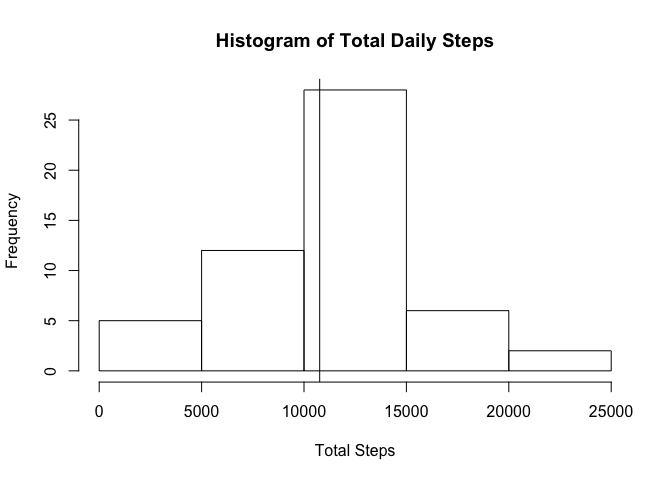
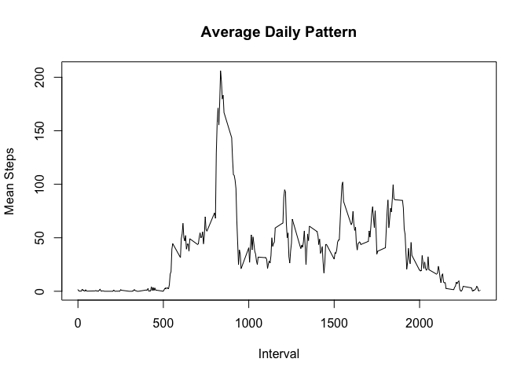
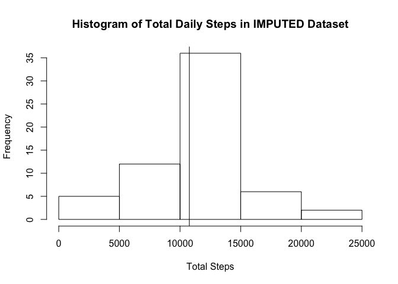
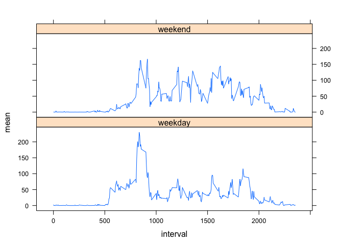

# Reproducible Research: Peer Assessment 1


## Loading and preprocessing the data
First we extract the activity data from the zipped archive.

```r
temp<-unz("activity.zip","activity.csv")
mydata<-read.csv(temp,header=TRUE)
unlink(temp)
remove(temp)
```

## What is mean total number of steps taken per day?


The **mean** number of steps is 10766, and the **median** is 10765. 

<!-- -->

## What is the average daily activity pattern?


The **maximum number of steps** occur in interval 835.

<!-- -->


## Imputing missing values


There are 2304 missing values in the dataset. 

In the imputed dataset, the **mean** number of steps is 10766, and the **median** is 10766. These values are nearly identical to the first part of the assignments. The imputations did not alter the mean/median values (though appears to have brought them closer together).

<!-- -->

## Are there differences in activity patterns between weekdays and weekends?


<!-- -->
